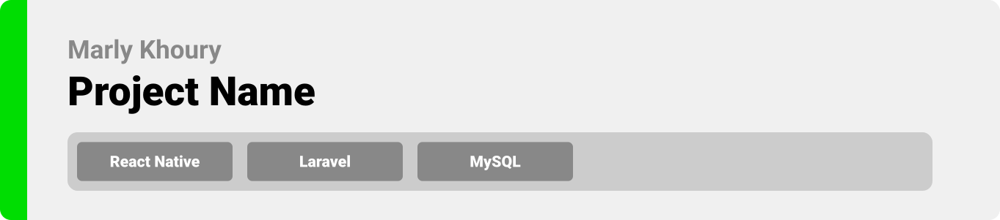

<div align="center">

> Hello world! This is the project’s summary that describes the project plain and simple, limited to the space available. 


**[PROJECT PHILOSOPHY](https://github.com/MarlyKhoury/AutoGo#-project-philosophy) • [WIREFRAMES](https://github.com/MarlyKhoury/AutoGo#-wireframes) • [TECH STACK](https://github.com/MarlyKhoury/AutoGo#-tech-stack) • [IMPLEMENTATION](https://github.com/MarlyKhoury/AutoGo#-impplementation) • [HOW TO RUN?](https://github.com/MarlyKhoury/AutoGo#-how-to-run)**

</div>

<br><br>


> AutoGo is a carpooling app built to help people share rides. AutoGo is built on the principle of less cars, less costs and less pollution. Indeed, AutoGo encourages users to carpool, meet new people and share the cost all while staying comfortable and safe.
> 
> There are 2 options that the AutoGo app provides: Create a ride and Book a ride.

### User Stories
- As a user, I want to create an account, so that I can save all my information in one place
- As a user, I want to quickly find and book a ride, so that I can reach my destination early
- As a user, I want to specify the gender of the people I’m going to share my ride with, so that I feel more comfortable
- As a user, I want to find other people going to the same place as I am, so that we can split the cost between us


<br><br>


> This design was planned before on paper, then moved to Figma app for the fine details.
Note that i didn't use any styling library or theme, all from scratch and using pure css modules

| Landing  | Home/Search  |
| -----------------| -----|
|  |  |

<!-- | Artists results  | Artist's Albums  |
| -----------------| -----|
|  |  | -->


<br><br>


Here's a brief high-level overview of the tech stack the AutoGo app uses:

- This project uses the [React Native app development Framework](https://reactnative.dev/). React Native is a JavaScript framework for writing real, natively rendering mobile applications for iOS and Android. It is based on React, Facebook's JavaScript library for building user interfaces, but instead of targeting the browser, it targets mobile platforms.
- For persistent storage (database), the app uses [MySQL](https://www.mysql.com/) which allows the app to create a scalable and reliable database.
- To send local push notifications, the app uses the [expo_local_notifications](https://docs.expo.dev/versions/latest/sdk/notifications/) package which supports Android, iOS, and macOS.
  - To get the origin and destination, the calculated travel distance and the calculated travel time, the app uses the Google Places API, the Google Directions API and the Distance Matrix API.
- The design of the app adheres to the material design guidelines.


<br><br>


> Using the above mentioned tech stacks and the wireframes built with figma from the user sotries we have, the implementation of the app is shown as below, these are screenshots from the real app

| Landing  | Home/Search  |
| -----------------| -----|
|  | .jpg) |

| Booking a Ride  | Ride Results  |
| -----------------| -----|
|  | .jpg) |


<br><br>


> This is an example of how you may give instructions on setting up your project locally.
To get a local copy up and running follow these simple example steps.

### Prerequisites

This is an example of how to list things you need to use the software and how to install them.
* npm
  ```sh
  npm install npm@latest -g
  ```

### Installation

_Below is an example of how you can instruct your audience on installing and setting up your app. This template doesn't rely on any external dependencies or services._

1. Get a free API Key at [https://example.com](https://example.com)
2. Clone the repo
   ```sh
   git clone https://github.com/your_username_/Project-Name.git
   ```
3. Install NPM packages
   ```sh
   npm install
   ```
4. Enter your API in `config.js`
   ```js
   const API_KEY = 'ENTER YOUR API';
   ```

